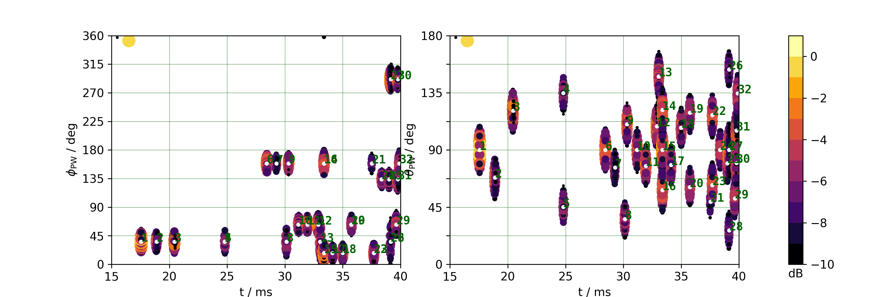
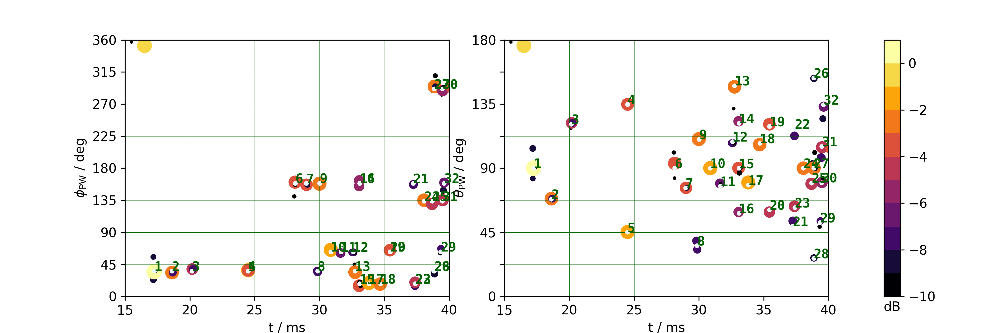

# doa-early-room-reflections-pwd-vs-omp

`estimate_early_reflections_OMP.ipynb` creates the figures
of

Frank Schultz, Sascha Spors (2019): "On the detection quality of early room reflection directions using compressive sensing on rigid spherical microphone array data",
In: *Proc. of 23rd Intl Congress on Acoustics*, Aachen, Germany, 2676-2683.

Here, we compare direction of arrival (DOA) of early room reflections using plane wave decomposition (PWD, top figure) vs.
compressive sensing (CS) using orthogonal matching pursuit (OMP, bottom figure)
for a certain room scenario and different microphone array configurations.

**Figure 2** from paper: Early room reflections’ DOA over time. Left: azimuth, right: colatitude, top: PWD |pφm×θm×t| in dB, bottom: CS-OMP |xφm×θm×t| in dB. Rigid microphone array, spherical Lebedev grid with 170 receivers, 4th order image source model, all walls brick (absorption coefficient 0.15), no additive noise.

## Paper and Poster

The paper can be found [here](paper/SchultzSpors_2019_PWD_vs_CS-OMP_ICA_Paper.pdf) in the repository.
The poster can be found [here](poster/SchultzSpors_2019_PWD_vs_CS-OMP_ICA_Poster.pdf) in the repository.

## Anaconda Environment

The conda environmet `conda_environment.yml` might be required to run the code
properly, there are some dependencies of older packages involved.

Furthermore, we require

https://github.com/sfstoolbox/sfs-python
(commit 3453e987ee742bd1c4af42af0c405df8363e6a4d worked)

https://github.com/spatialaudio/sfa-numpy
(commit bff5737ef429f31228d20a9e1d0ce7d46d3080d3 worked)

for image source modelling and sound field analysis stuff.
